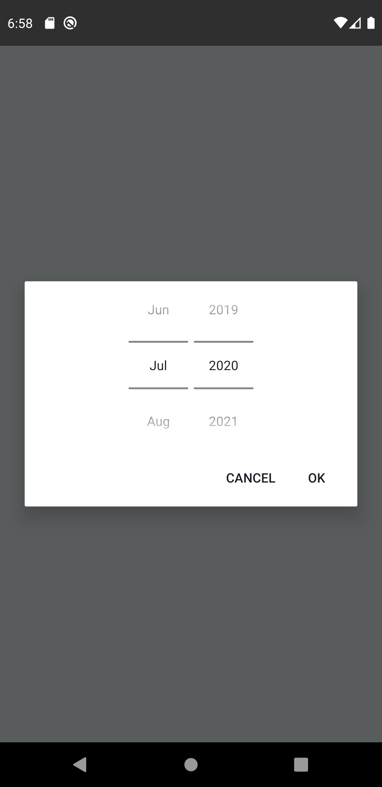
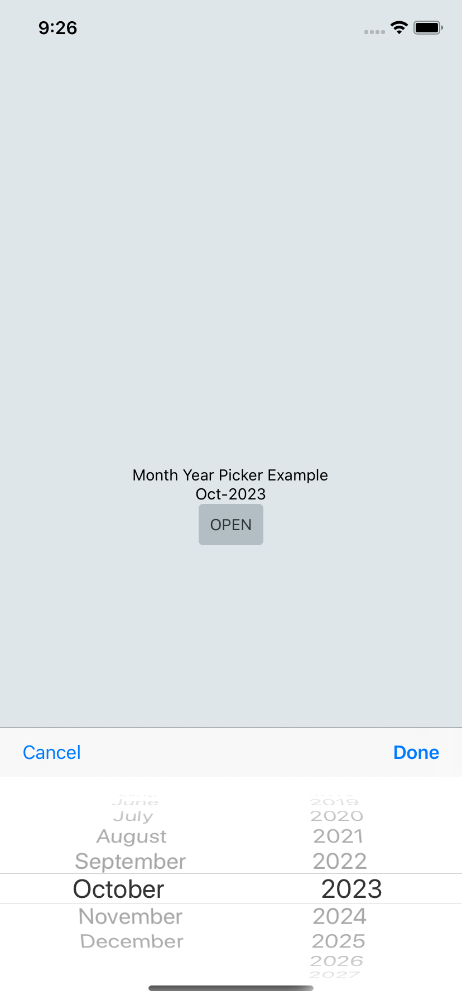
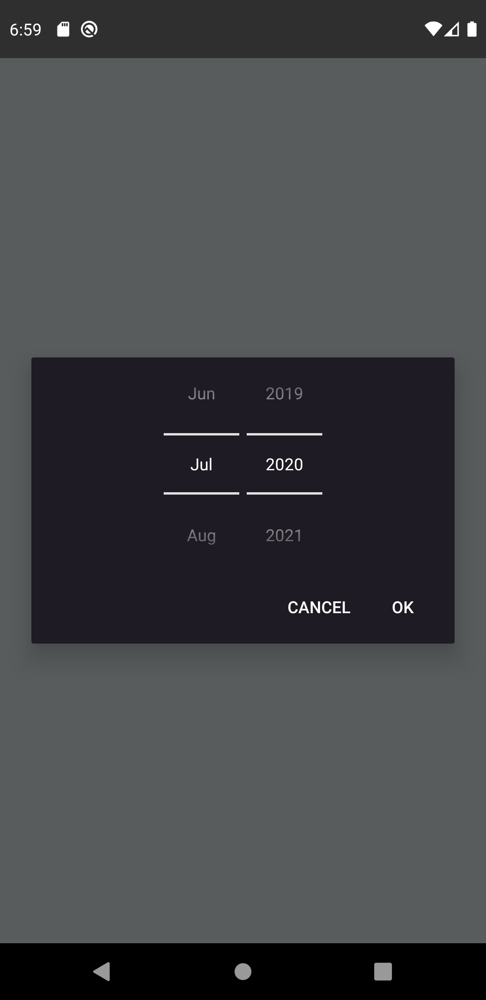
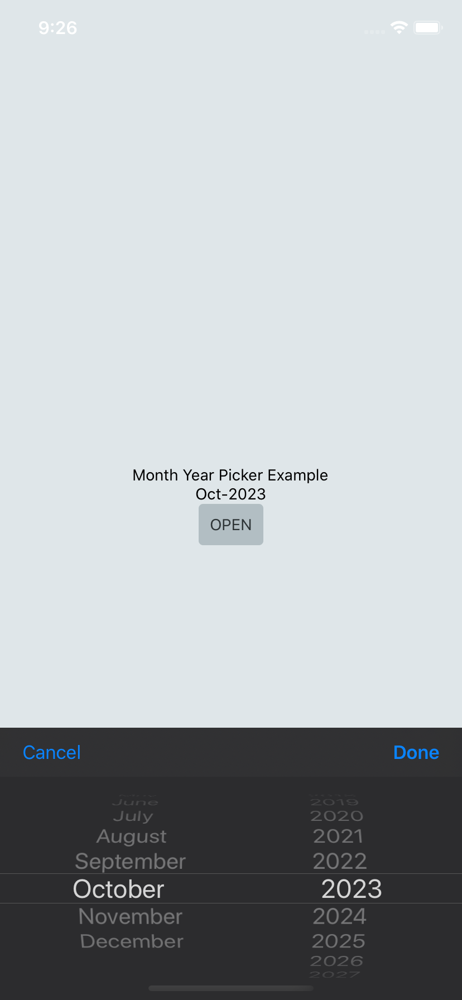

# react-native-month-year-picker
React Native month picker component for iOS and Android.

| UI Mode | Android | iOS |
| --- | --- | --- |
| <p align="center">***Light*** | |
| <p align="center">***Dark*** | |

## Getting started

`$ npm install react-native-month-year-picker --save`

or

`$ yarn add react-native-month-year-picker`

### For react-native@0.60.0 or above

As [react-native@0.60.0](https://reactnative.dev/blog/2019/07/03/version-60) or above supports autolinking, so there is no need to run linking process. 
Read more about autolinking [here](https://github.com/react-native-community/cli/blob/master/docs/autolinking.md).

#### iOS
CocoaPods on iOS needs this extra step

```
npx pod-install
```
## Usage
```javascript
import React, { useState, useCallback } from 'react';
import { View, SafeAreaView, Text } from 'react-native';
import MonthPicker from 'react-native-month-year-picker';

const App = () => {
  const [date, setDate] = useState(new Date());
  const [show, setShow] = useState(false);

  const showPicker = useCallback((value) => setShow(value), []);

  const onValueChange = useCallback(
    (event, newDate) => {
      const selectedDate = newDate || date;

      showPicker(false);
      setDate(selectedDate);
    },
    [date, showPicker],
  );

  return (
    <SafeAreaView>
      <Text>Month Year Picker Example</Text>
      <Text>{moment(date, "MM-YYYY")}</Text>
      <TouchableOpacity onPress={() => showPicker(true)}>
        <Text>OPEN</Text>
      </TouchableOpacity>
      {show && (
        <MonthPicker
          onChange={onValueChange}
          value={date}
          minimumDate={new Date()}
          maximumDate={new Date(2025, 5)}
          locale="ko"
        />
      )}
    </SafeAreaView>
  );
};

export default App;

```

## Props

#### `onChange` (`optional`)

Date change handler.

This is called when the user changes the date in the UI. It receives the event and the date as parameters.

```js
setDate = (event, date) => {};

<RNMonthPicker onChange={this.setDate} />;
```
Events returned by onChange function:
```js
import { ACTION_DATE_SET, ACTION_DISMISSED, ACTION_NEUTRAL } from 'react-native-month-year-picker';
...
onValueChange = (event, newDate) => {
  switch(event) {
    case ACTION_DATE_SET:
      onSuccess(newDate);
      break;
    case ACTION_NEUTRAL:
      onNeutral(newDate);
      break;
    case ACTION_DISMISSED:
    default:
      onCancel(); //when ACTION_DISMISSED new date will be undefined
  }
}
...
```

#### `value` (`required`)

Defines the date value used in the component.

```js
<RNMonthPicker value={new Date()} />
```

#### `locale` (`optional`)

Defines the month list locale. If not sent, it defaults to device's language.

```js
<RNMonthPicker locale="ru" />
```

#### `mode` (`optional`)

Defines the month list display mode. It could be either `full`, `short`, `number` or `shortNumber`. Default `full`.

| mode | display |
| --- | --- |
| **full** | *September* |
| **short** | *Sep* |
| **number** | *09* | 
| **shortNumber** | *9* | 

```js
<RNMonthPicker mode="number" />
```
#### `autoTheme` (`optional`)

Enables phone's UI Mode color recognition; for Android 10+ and iOS 13+. Lower OS versions will always be Light Mode. Default `true`.

```js
<RNMonthPicker autoTheme={false} />
```

#### `maximumDate` (`optional`)

Defines the maximum date that can be selected. Use year and month constructor.

```js
<RNMonthPicker maximumDate={new Date(2030, 10)} />
```

#### `minimumDate` (`optional`)

Defines the minimum date that can be selected. Use year and month constructor.

```js
<RNMonthPicker minimumDate={new Date(2020, 5)} />
```

#### `okButton` (`optional`)

Picker modal confirmation button text. Default `Done`.

```js
<RNMonthPicker okButton="Confirm" />
```

#### `cancelButton` (`optional`)

Picker modal cancelation button text. Default `Cancel`.

```js
<RNMonthPicker cancelButton="Abort" />
```

#### `neutralButton` (`optional`)

Picker modal neutral button text. If not sent, button won't appear. Default `null`.

```js
<RNMonthPicker neutralButton="Delete" />
```

## Running example
1. Install required pods by running `yarn pod:install`.
2. Run `yarn start` to start Metro Bundler.
3. Run `yarn run:ios` or `yarn run:android`.
